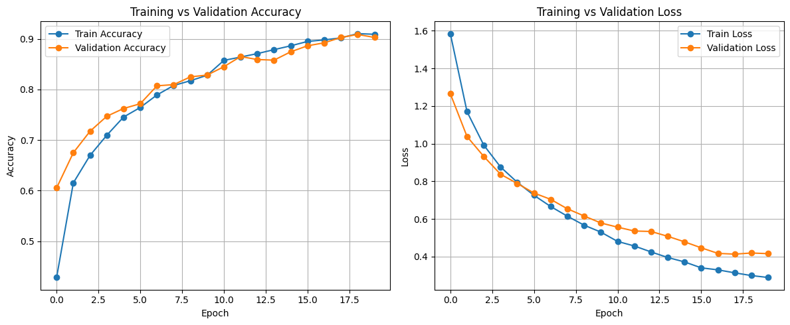
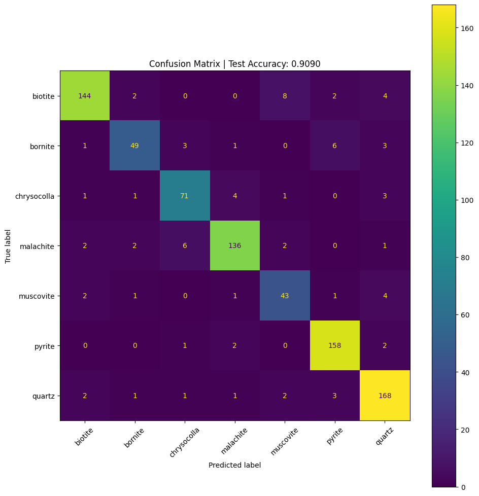
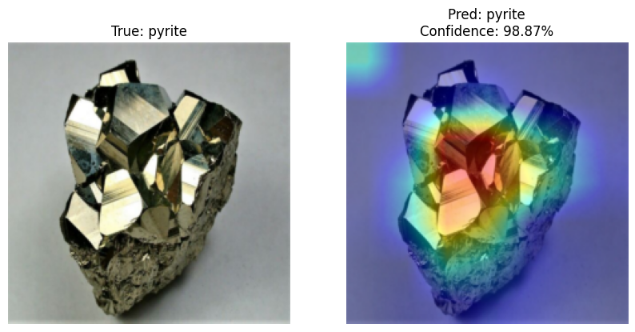
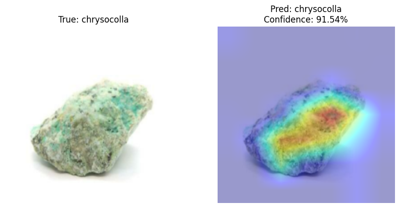

# Explainable Mineral Classification using EfficientNet-B3

A deep learning based computer vision model for mineral specimen classification using transfer learning and Grad-CAM explainability.

## Project Overview

This project performs mineral image classification using a fine-tuned EfficientNet-B3 model trained on RGB mineral specimen images.

The system combines:

* transfer learning
* data augmentation
* class imbalance handling
* explainable AI through Grad-CAM

to build an end-to-end explainable mineral classification pipeline.

The model learns visually discriminative mineral features such as:

* crystal geometry
* metallic reflectance
* texture distribution
* surface morphology

## Features

* EfficientNet-B3 transfer learning
* Advanced image augmentation pipeline
* Class-weighted CrossEntropyLoss
* Grad-CAM explainability visualizations
* Confusion matrix and classification metrics
* PyTorch training and evaluation pipeline
* Inference-ready architecture

## Model Pipeline

```text
Input Image
   ↓
Preprocessing + Augmentation
   ↓
EfficientNet-B3 Backbone
   ↓
Classification Head
   ↓
Softmax Probabilities
   ↓
Grad-CAM Explainability
```

## Dataset

* RGB mineral specimen image dataset
* Multiple mineral classes including:

  * biotite
  * bornite
  * chrysocolla
  * malachite
  * muscovite
  * pyrite
  * quartz

### Dataset Split

* 70% Training
* 15% Validation
* 15% Testing

## Training Configuration

| Component     | Value             |
| ------------- | ----------------- |
| Backbone      | EfficientNet-B3   |
| Framework     | PyTorch           |
| Optimizer     | AdamW             |
| Loss Function | CrossEntropyLoss  |
| Scheduler     | ReduceLROnPlateau |
| Image Size    | 224×224           |
| Batch Size    | 32                |

### Augmentations

* Random Resized Crop
* Horizontal Flip
* Rotation
* Color Jitter

# Results

## Benchmark & Model Optimization Results

Evaluated across all **846 images** in the test set.

### Comparison Summary

| Metric | FP32 Baseline (PyTorch) | FP16 (ONNX Runtime) | INT8 Static PTQ (ONNX Runtime) |
| :--- | :---: | :---: | :---: |
| **Model Artifact** | `models/model.pth` | `models/model_fp16.onnx` | `models/model_int8_ptq.onnx` |
| **Model Size** | `44.36 MB` | `21.99 MB` (**50.4% smaller**) | `12.54 MB` (**71.7% smaller / 3.54x**) |
| **Top-1 Accuracy** | `91.25%` | `91.13%` | `90.54%` |
| **Macro F1-Score** | `0.8906` | `0.8887` | `0.8817` |
| **Weighted F1-Score** | `0.9118` | `0.9105` | `0.9043` |
| **Median Latency (P50)** | `207.15 ms` | `132.30 ms` (**+36.1% speedup**) | `120.76 ms` (**+41.7% speedup**) |
| **95th Percentile (P95)** | `236.54 ms` | `191.60 ms` | `188.82 ms` |
| **Throughput (FPS)** | `5.25 FPS` | `7.00 FPS` (**+33.3% higher**) | `7.24 FPS` (**+37.9% higher**) |
| **Forward Pass Time** | `115.88 ms` | `34.03 ms` (**3.4x faster**) | `20.71 ms` (**5.6x faster**) |
| **Model RAM Overhead** | `98.99 MB` | `51.43 MB` (**48.0% less RAM**) | `27.07 MB` (**72.7% less RAM**) |

### Per-Class Performance (846 Ground-Truth Images)

| Mineral Class | Images | FP32 Acc / F1 | FP16 Acc / F1 | INT8 PTQ Acc / F1 |
| :--- | :---: | :---: | :---: | :---: |
| **biotite** | 160 | 93.8% / 0.9404 | 93.8% / 0.9375 | 95.0% / 0.9268 |
| **bornite** | 63 | 79.4% / 0.8264 | 77.8% / 0.8167 | 74.6% / 0.8319 |
| **chrysocolla** | 81 | 81.5% / 0.8408 | 81.5% / 0.8408 | 84.0% / 0.8500 |
| **malachite** | 149 | 94.6% / 0.9246 | 94.6% / 0.9246 | 91.3% / 0.9097 |
| **muscovite** | 52 | 80.8% / 0.8235 | 80.8% / 0.8235 | 75.0% / 0.7800 |
| **pyrite** | 163 | 96.3% / 0.9429 | 96.3% / 0.9429 | 93.9% / 0.9444 |
| **quartz** | 178 | 93.3% / 0.9352 | 93.3% / 0.9352 | 96.1% / 0.9293 |
| **Macro Average** | 846 | 91.2% / 0.8906 | 91.1% / 0.8887 | 90.5% / 0.8817 |

### Latency & Speed Distribution (20 Warmup + 200 Measured Iterations)

| Metric | FP32 Baseline | FP16 (ONNX) | INT8 PTQ (ONNX) |
| :--- | :---: | :---: | :---: |
| **Cold Start (1st inference)** | `204.76 ms` | `129.85 ms` | `109.51 ms` |
| **Mean Latency** | `190.35 ms` | `142.96 ms` | `138.20 ms` |
| **Median (P50)** | `207.15 ms` | `132.30 ms` | `120.76 ms` |
| **90th Percentile (P90)** | `225.57 ms` | `171.90 ms` | `176.35 ms` |
| **95th Percentile (P95)** | `236.54 ms` | `191.60 ms` | `188.82 ms` |
| **99th Percentile (P99)** | `289.71 ms` | `243.07 ms` | `229.20 ms` |
| **Min / Max** | `93.6 / 337.3 ms` | `121.0 / 276.3 ms` | `108.1 / 250.8 ms` |
| **Standard Deviation** | `46.51 ms` | `24.14 ms` | `29.18 ms` |
| **Throughput (FPS)** | **`5.25 FPS`** | **`7.00 FPS`** | **`7.24 FPS`** |

### Memory Footprint Comparison

| Stage / Metric | FP32 Baseline | FP16 (ONNX) | INT8 PTQ (ONNX) |
| :--- | :---: | :---: | :---: |
| **Process Baseline RSS** | `354.22 MB` | `449.68 MB` | `408.15 MB` |
| **After Model Load** | `453.21 MB` | `501.12 MB` | `435.22 MB` |
| **Net Model RAM Overhead** | `98.99 MB` | `51.43 MB` | `27.07 MB` |
| **Peak Process RSS** | `449.68 MB` | `503.94 MB` | `426.62 MB` |
| **Peak Python Allocation (tracemalloc)** | `14.98 MB` | `11.69 MB` | `11.68 MB` |

## Training Curves

The model demonstrates stable convergence with consistent validation performance and limited overfitting.



## Confusion Matrix

The confusion matrix shows strong classification performance across most mineral classes, with minor confusion between visually similar minerals.



# Grad-CAM Explainability

Grad-CAM visualizations indicate that the model focuses on mineral-specific visual regions such as:

* reflective crystal structures
* texture distributions
* surface morphology
* geometric mineral patterns

rather than relying on background artifacts.

## Pyrite Grad-CAM

The model strongly attends to reflective crystal facets and metallic geometric structures while classifying pyrite.



## Chrysocolla Grad-CAM

The model focuses on diffuse texture regions and color concentration patterns for chrysocolla classification.



# Instructions

1. Install dependencies:

```bash
pip install -r requirements.txt
```

2. Run the Streamlit app:

```bash
streamlit run app.py
```
